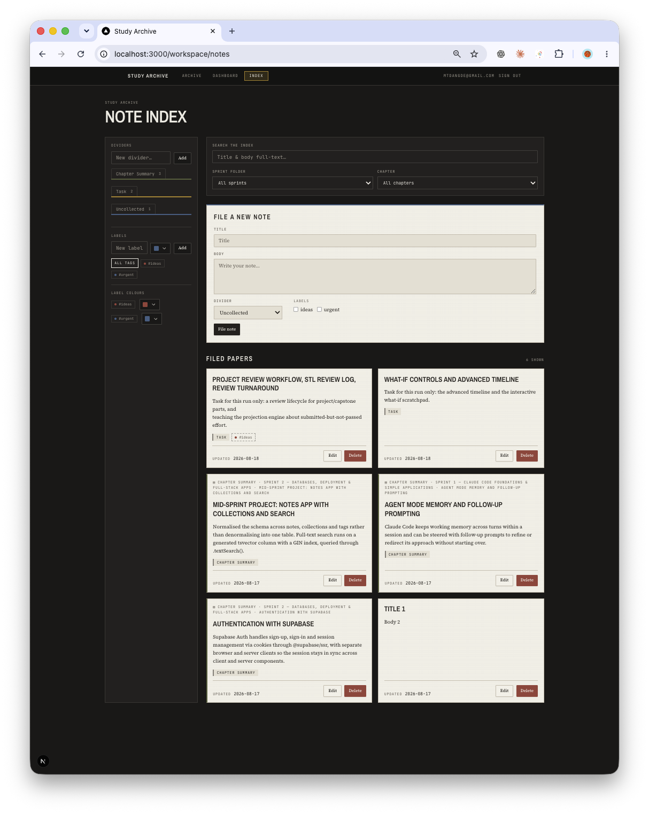

# Study Archive

A personal, per-user notes and course-progress workspace, built with Next.js and Supabase.

Signed-in users get:

- **Notes** — create, edit, and delete notes, organize them into collections, and tag/filter them, with live search.
- **Tracker** — a sprint/part tracker for a course, plus a dashboard that projects completion against a target date.

Every route under `/workspace` requires a signed-in user (checked server-side, not just in the browser), and every row in the database is scoped to the account that created it via Postgres Row Level Security — one user never sees another user's notes.

## Running it locally

1. Install dependencies:

   ```bash
   npm install
   ```

2. Create a Supabase project (or use an existing one with the `notes`/`collections`/`tags`/`sprints`/`parts`/`course` tables from `supabase/migrations/`), then copy `.env.example` to `.env.local` and fill in the two values:

   ```env
   NEXT_PUBLIC_SUPABASE_URL=
   NEXT_PUBLIC_SUPABASE_PUBLISHABLE_KEY=
   ```

   Both are found in the Supabase dashboard under **Project Settings → API** — `NEXT_PUBLIC_SUPABASE_URL` is the Project URL, and `NEXT_PUBLIC_SUPABASE_PUBLISHABLE_KEY` is the publishable/anon key (Supabase may label it either way; both work here). Never put a service-role key in this file — it's `NEXT_PUBLIC_*`, so anything here ships to the browser.

3. Apply the migrations in `supabase/migrations/` to your project (via the Supabase CLI or by pasting them into the SQL Editor), then create at least one test user under **Authentication → Users** in the Supabase dashboard — this app has no self-service sign-up, accounts are created by hand for now.

4. Start the dev server:

   ```bash
   npm run dev
   ```

5. Open [http://localhost:3000](http://localhost:3000), sign in at `/login` with the test account from step 3, and you'll land on `/workspace/notes`.

## Screenshot



## Optional tasks

- **Tags** (Medium): a `tags` column/table plus a tag filter in the notes UI, so a user can view only notes carrying a given tag (multi-select, AND-combined). Delivered on `feature/tag-colors`, merged via PR #1.
- **Loading states** (Easy): skeleton placeholders for the notes/tracker/dashboard lists while they fetch from Supabase, instead of a blank-list flash. Delivered on `feature/loading-states`, merged via PR #5.
- **GitHub social login** (Hard): a "Sign in with Github" option alongside email/password, using Supabase's GitHub OAuth provider. Delivered on `feature/loading-states`, merged via PR #5.

## Stack

Next.js (App Router) + Supabase (Postgres, Auth, RLS) + Tailwind CSS + shadcn/ui. See `CLAUDE.md` for the auth and Supabase conventions this project follows.
